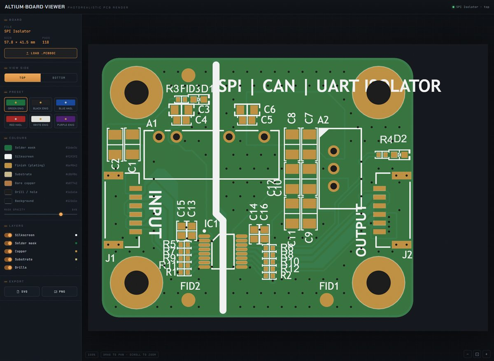

# BoardViewer

An interactive **Altium Board Viewer** web app: drag-and-drop a PCB document
(`.PcbDoc`) and explore a photorealistic render of it in the browser.

```
dotnet run --project examples/BoardViewer
```

Then open the printed URL (e.g. `http://localhost:5000`) and drop in a `.PcbDoc`.



## Features

- **Drag & drop** (or browse) an Altium `.PcbDoc`.
- **Photorealistic render** of the board via `SvgRenderer.RenderRealisticAsync`.
- **Top / bottom** side switch.
- **Colour controls** for the solder mask (with opacity), silkscreen, finish/plating,
  substrate, bare copper and drill holes — plus one-click presets (green ENIG, black
  ENIG, blue/red HASL, …).
- **Layer toggles** — turn substrate / copper / solder mask / silkscreen / drills on
  and off **instantly**, with no server round-trip.
- **Pan & zoom** the board; **export** the current view as **SVG** or **PNG**.

## How it works

The server is a small minimal API (`Program.cs`):

| Endpoint | Purpose |
|---|---|
| `POST /api/upload` | Parses the uploaded board once (`AltiumLibrary.OpenPcbDocAsync(stream)`), caches it in memory, returns an id + metadata. |
| `POST /api/render.svg` | Re-renders the cached board to SVG with the requested `PcbRealisticStyle` (colours, side). |

The interesting part is what the server *doesn't* have to do. The photorealistic SVG
emits each physical layer as a named group:

```html
<g id="substrate">…</g>
<g id="copper">…</g>
<g id="soldermask">…</g>
<g id="silkscreen">…</g>
<g id="drills">…</g>
```

so the front-end (`wwwroot/index.html`) does **layer toggling** and **PNG export**
entirely client-side — toggling a layer just sets `display:none` on its `<g>`, and the
PNG is rasterised from the live SVG onto a `<canvas>`. The server is only asked to
re-render when a colour or the board side changes.

This is purely a local viewer — the board is read in-process and never leaves the
service. For rendering boards from the command line instead, see the **RenderBoard**
example.
